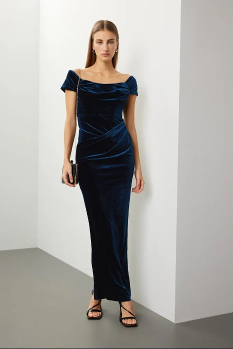
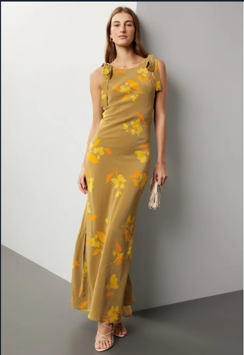
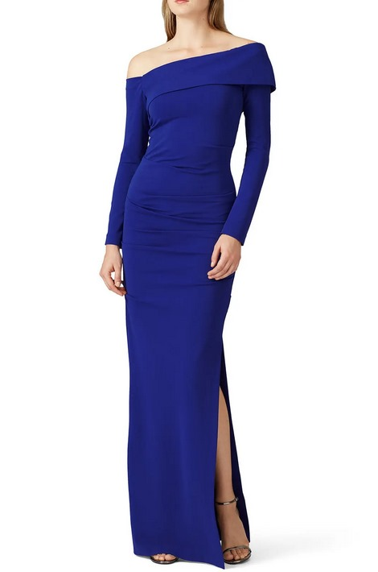
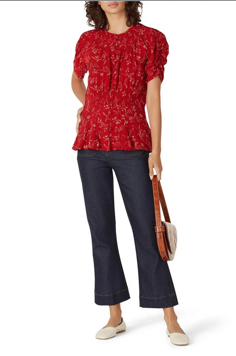
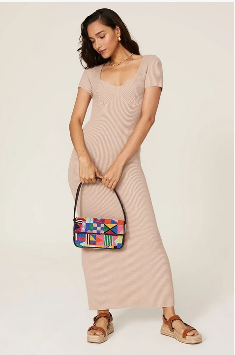
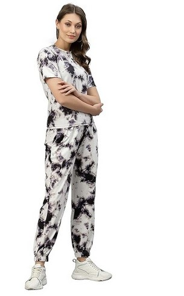
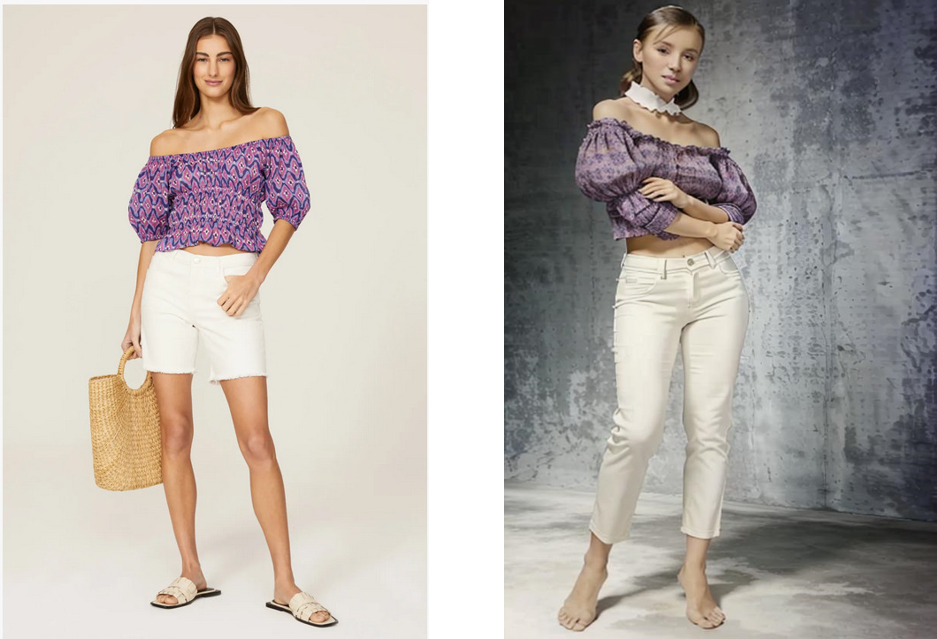
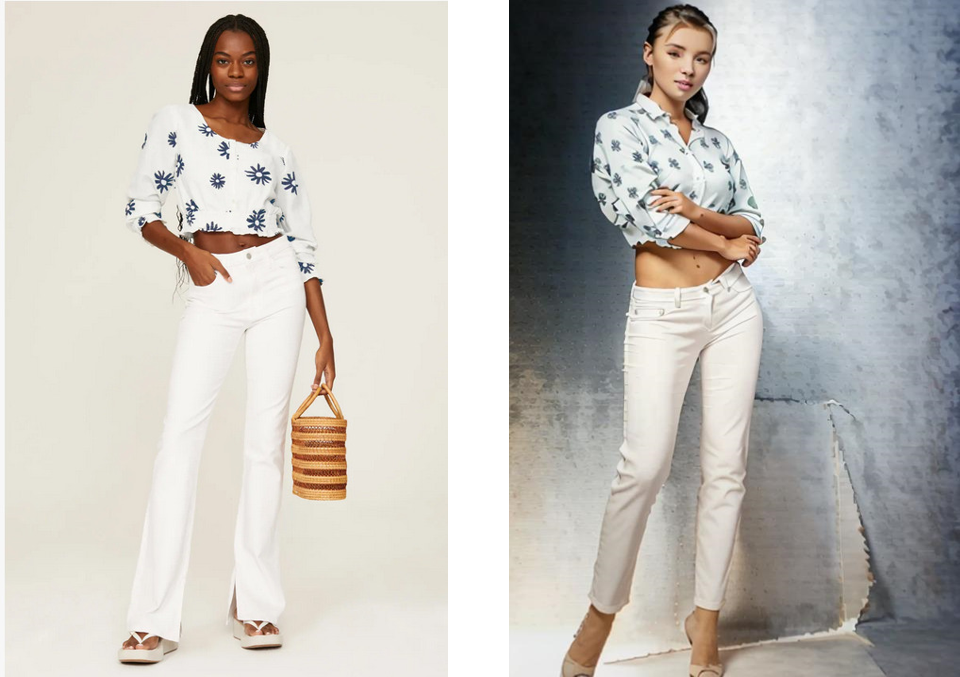
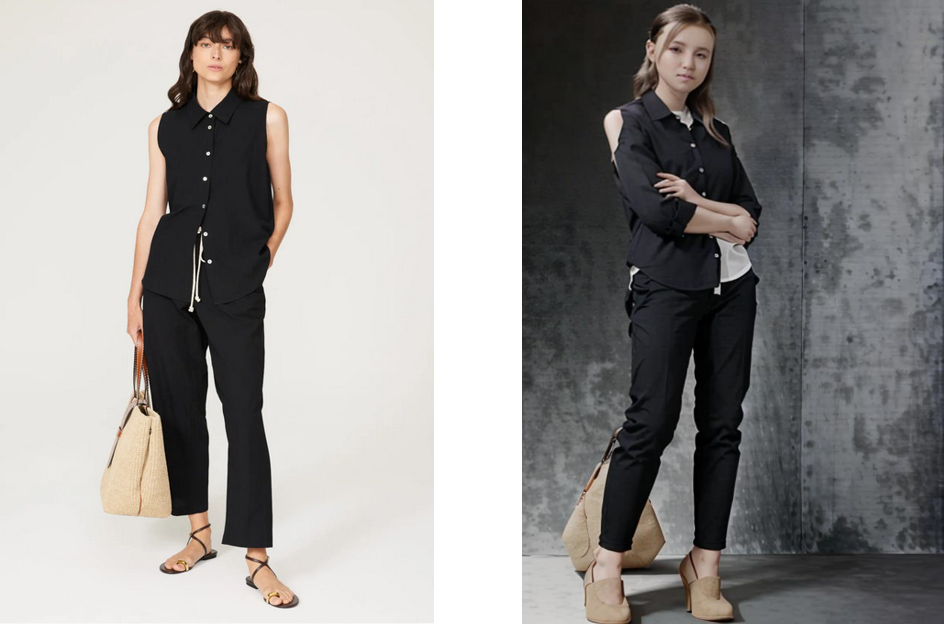

## Title: Women's Fashion Recommender System
Abstract: 
  This project aims to revolutionize women's fashion by integrating
  cutting-edge technologies like LightFM, deep learning-based models,
  and stable diffusion-based models to enable virtual try-on
  experiences. Our primary goal is to develop an immersive and
  personalized fashion recommendation system, empowering users to
  explore and experiment with diverse clothing styles virtually.
  Leveraging LightFM's capabilities, we employ collaborative and
  content-based filtering techniques to tailor recommendations based on
  users' preferences and interactions. Additionally, deep learning
  models extract intricate features from fashion items, ensuring
  accurate matching with user preferences and body types. Furthermore,
  stable diffusion-based models enable realistic virtual try-on
  experiences, simulating garment fit and fabric drape with exceptional
  fidelity. Through seamless integration of these technologies and a
  user-centric design approach, we aim to redefine the fashion shopping
  experience, empowering users to effortlessly discover and embrace
  their unique sense of style.

# Introduction

## Background

Women's fashion preferences are influenced by a myriad of factors,
including personal taste, body type, and occasion. Among these, cultural
background plays a significant role in shaping fashion choices. Cultural
heritage and traditions inform not only the styles and colors women
prefer but also the types of clothing deemed appropriate for various
events. With the globalization of fashion and the increasing cultural
diversity of customer bases, it becomes essential for fashion
recommendation systems to be culturally sensitive and inclusive.

Rent the Runway is an online service that allows women to rent designer
dresses and accessories for different occasions. The Rent the Runway
ClothFit dataset provides a rich repository of rental transactions,
capturing detailed information about user preferences, demographics, and
interactions with the platform. This dataset is particularly relevant
for developing a recommendation system that can cater to diverse
cultural identities, offering personalized suggestions that respect and
celebrate these differences.

## Problem Statement

The central challenge addressed in this project is the development of a
recommendation system that recognizes and respects cultural diversity in
fashion preferences. Traditional recommendation algorithms primarily
rely on user-item interaction data, which might not sufficiently capture
the nuanced influences of cultural background on fashion choices. Given
the sparsity of interactions in the Rent the Runway ClothFit
dataset---where most users have rented only one or two dresses---it
becomes even more challenging to identify patterns that align with
cultural sensitivities.

Our goal is to create a recommendation system that goes beyond standard
collaborative filtering approaches, integrating cultural context into
the personalization process. This involves leveraging the rich attribute
data available in the dataset, such as user demographics and detailed
garment information, to inform the recommendations. By doing so, we aim
to offer tailored fashion suggestions that not only align with
individual user preferences but also celebrate and respect their
cultural identities and heritage.

## Objective

The objective of this project is to develop a recommendation system for
women's fashion on Rent the Runway that is culturally sensitive and
inclusive. By leveraging the Rent the Runway ClothFit dataset, we aim to
create a system that offers personalized fashion recommendations while
respecting and celebrating the diverse cultural backgrounds of users.
Through the integration of cultural context into the recommendation
process, we seek to enhance the user experience and foster a more
inclusive fashion environment on the platform.

# Dataset Introduction

In this project, we utilized the Rent the Runway ClothFit dataset, a
comprehensive dataset capturing detailed information on clothing rentals
and customer interactions. This dataset is particularly well-suited for
developing and evaluating a clothing recommendation system due to its
real-world relevance and inherent complexity. Rent the Runway is a
popular online service that facilitates the rental of designer dresses
and accessories, and the dataset provides extensive data on customer
preferences, rental history, and garment attributes.

## Dataset Composition

The dataset comprises 192,544 rows, representing rental transactions
involving 105,571 unique users and 5,850 distinct items. The clothing
items span across 68 different categories, providing a diverse range of
choices for recommendation algorithms. Key attributes in the dataset
include user demographics, garment metadata (such as style, size, and
brand), and rental transaction details. Specifically, the attributes
include *user_id*, *bust size*, *item_id*, *weight*, *rating*, *rented
for*, *review_text*, *body type*, *review_summary*, *category*,
*height*, *size*, *age*, and *review_date*. This diversity of attributes
offers a rich foundation for experimenting with multiple recommendation
algorithms, aiming to personalize the rental experience based on
individual user profiles and historical interactions.

## Challenges in the Dataset

One of the primary challenges presented by the Rent the Runway ClothFit
dataset is the sparsity of user-item interactions. A significant
proportion of users have rented only one or two dresses, with a median
rental count of one per user. This results in a highly sparse user-item
interaction matrix, making it difficult for traditional recommendation
algorithms to find sufficient patterns and correlations. Additionally,
the median item buy count is 14, indicating that while some items are
rented frequently, many others have much fewer interactions, further
contributing to the sparsity issue. This sparsity poses substantial
challenges for collaborative filtering algorithms, which typically
depend on a substantial volume of interaction data to generate accurate
recommendations. The limited interaction data means that traditional
algorithms might struggle to identify patterns and make reliable
predictions.

## Relevance and Practicality

Despite these challenges, we selected the Rent the Runway ClothFit
dataset for several compelling reasons. Firstly, the dataset closely
mirrors the conditions that a startup or rapidly growing company might
encounter---having limited interactions per user while still needing to
provide effective recommendations. This makes our project highly
relevant for practical applications in the early stages of business
development. Secondly, the dataset's real-world nature ensures that our
findings and improvements have direct applicability to similar
recommendation systems in the industry.

## Data Preprocessing

To effectively utilize the dataset, certain preprocessing steps were
necessary. Attributes such as height, weight, and bust size were
converted to a consistent format to ensure uniformity in the data. This
preprocessing step was crucial for the accurate application of
recommendation algorithms, particularly those that utilize user physical
characteristics for personalized recommendations.

## Insights and Opportunities

The Rent the Runway ClothFit dataset serves as a rich resource for
developing and testing cloth recommendation systems. Despite the
inherent challenges of data sparsity and the diversity of interactions,
it provides a realistic scenario akin to the data landscape faced by
emerging companies in the online fashion rental industry. Through
careful preprocessing and the application of various recommendation
algorithms, this dataset offers valuable insights and opportunities for
innovation in personalized fashion recommendations.

# Comprehensive Analysis of Recommendation Algorithms

Our pursuit of enhancing the user experience on Rent the Runway has led
us to a thorough exploration and evaluation of a diverse array of
recommendation algorithms. Each algorithmic approach has been
meticulously designed and implemented to uncover patterns, understand
user preferences, and refine the recommendation system. In this
comprehensive analysis, we delve into the intricacies of each algorithm,
shedding light on its methodology, performance metrics, and insights
gleaned from the experimentation process.

## Content-Based Recommendation System

At the core of our recommendation system lies the content-based
approach, which harnesses the rich textual data embedded within user
reviews. Through the application of TF-IDF (Term Frequency-Inverse
Document Frequency), we transform textual reviews into numerical
embeddings, encapsulating the essence of users' feedback. These
embeddings are then subjected to K-means clustering, facilitating the
categorization of users based on the similarity of their expressed
preferences. When a user seeks a recommendation, the system dynamically
identifies the cluster whose preferences resonate with the user's
request and suggests dresses that have garnered favor within that
cluster. The Silhouette Score, standing at 0.0071, underscores the
model's reasonable performance in aligning recommendations with user
preferences.

## Collaborative Filtering

Collaborative filtering serves as a cornerstone in our recommendation
system, aiming to uncover underlying patterns through the analysis of
user-item interactions.

### K Nearest Neighbours (KNN)

K Nearest Neighbours (KNN) stands as a robust approach within
collaborative filtering, leveraging a plethora of user features,
including age, body measurements, and other relevant attributes. This
methodology computes recommendations based on user similarity, discerned
through the calculation of Euclidean distance in a multi-dimensional
feature space. By identifying users who share similarities with the
target user, the algorithm effectively draws on the preferences of these
'neighbours' to generate personalized recommendations. The Mean
Reciprocal Rank (MRR) of 0.0052 underscores the algorithm's adeptness at
identifying users with similar tastes and recommending items
accordingly. Through its comprehensive consideration of user attributes
and nuanced understanding of user similarity, KNN emerges as a powerful
tool in facilitating tailored recommendations on Rent the Runway.

### Cosine Similarity

The Cosine Similarity methodology represents another notable approach in
collaborative filtering, offering unique insights into product
relationships based on user perceptions reflected in reviews. This
method involves preprocessing product reviews and harnessing Word2vec
for word embeddings, enabling the measurement of how closely products
are related in terms of user perception. The resulting Average Precision
at 5 of approximately 0.00017 highlights the algorithm's nuanced ability
to discern product similarities and make refined recommendations. By
capturing subtle nuances in user preferences and product relationships,
Cosine Similarity enriches the recommendation process, contributing to
an enhanced user experience on Rent the Runway.

### K Means Clustering

In a similar vein to the content-based approach, K Means Clustering
emerges as a compelling strategy within collaborative filtering,
facilitating personalized recommendations tailored to distinct user
groups. This methodology categorizes users into clusters based on their
attributes, fostering a deeper understanding of user preferences and
facilitating the delivery of tailored recommendations congruent with
each cluster's characteristics. The Silhouette Score of 0.0071 reaffirms
the model's capacity for delivering tailored recommendations. By
segmenting users into cohesive groups and aligning recommendations with
their shared preferences, K Means Clustering offers a nuanced approach
to collaborative filtering, enriching the recommendation process and
elevating the user experience on Rent the Runway.

### Singular Value Decomposition (SVD)

Singular Value Decomposition (SVD) stands as a foundational technique
within collaborative filtering, offering insights into latent factors
that influence user preferences and item appeal. By decomposing the
user-item rating matrix, SVD unveils underlying patterns and
relationships, facilitating the generation of accurate recommendations.
The algorithm's RMSE of 1.41432 reflects a competent grasp of item
correlations, crucial for predicting user preferences accurately.
Through its adept handling of complex data structures and nuanced
understanding of user-item interactions, SVD contributes to the
refinement of the recommendation system, fostering a more personalized
and engaging user experience on Rent the Runway.

### Multi-Arm Bandit

Multi-armed bandits are essential for any recommender system to maximise
user engagement and utility. It's our tool to understand complex user
behaviour. In our model, We have 68 categories of garments in our
dataset which are considered arms, The business pulls the arms and the
user gives the reward in the form of a rating or just buying the
product.

**UCB Recommender:** This algorithm selects arms based on the ucb values
given by the formula
$$UCB[arm] = \mu[arm] + \sqrt{\frac{\alpha\ln(T[user])}{N[arm]}}$$ where
$\mu$ is the average rating of the total items present in that arm, and
T is the current time step of the user. N is the number of times the
business has pulled that category/arm. $\alpha$ is the exploration
control factor. We choose $\alpha$ as 1 for the working of the model.

The UCB Recommender selects the top two arms with the highest ucb values
and then recommends the users half items from each of the arms. The
items are selected based on their average rating.\
\
**Thompson Sampling:** This is a probabilistic approach to the
multi-armed bandit problem, This will make decisions by sampling from
the posterior distribution of the arm's rewards. Each arm is associated
with a prior distribution representing beliefs about its reward
distribution. After observing outcomes, the prior distributions are
updated using Bayes' theorem to obtain posterior distributions. We are
using user-buy to update the distributions. For illustration and
convergence purposes we have only used 4 categories in the
implementation of the model, i.e., Gown, dress, top, and sheath.

### Deep Learning based Recommendation System

The deep learning model utilizes user and product embeddings to forecast
ratings for user-item interactions. User embeddings are constructed from
textual data, such as tokenized text, coupled with numerical features
such as height, weight, age, and bust size. Similarly, product
embeddings are derived from textual information and numerical attributes
like height, weight, age, and rating. These embeddings effectively
encapsulate semantic details and user-item interactions, serving as the
foundation for the recommendation model.

The neural network architecture comprises three dense layers employing
ReLU activation functions. This model is trained using the Adam
optimizer and the Mean Squared Error (MSE) loss function. Throughout the
training process, the model achieved an MSE of 1.71 on the training
dataset and a marginally lower validation loss of 1.63. These results
indicate reasonable performance in the prediction of ratings.To predict
ratings for a new user, we constructed a new user profile based on their
preferences, leveraging the same process used during training to create
user embeddings.

# Multi-modal Recommendation System

## Data Preparation

Our study began with meticulous data collection, assembling a diverse
dataset comprising user profiles, product specifications, ratings, and
associated reviews. The focal point was to create a multi-modal dataset
seamlessly integrating textual and visual information. With careful
selection, we curated a corpus of 100 images sourced from the esteemed
'Rent the Runway' website, each meticulously paired with corresponding
textual reviews to ensure coherence and relevance. This dataset formed
the bedrock for our proof-of-concept validation, enabling exploration of
the synergies between visual and textual cues in the recommendation
process.

## Model Architecture and Training

Subsequently, we developed a sophisticated neural network architecture
comprising four layers, strategically engineered to harness the
multi-modal nature of our dataset. This architecture was meticulously
crafted to accommodate inputs from both visual and textual modalities,
facilitating seamless integration of information. Through rigorous
training over 50 epochs, our model underwent iterative refinement,
leveraging advanced optimization techniques to adeptly translate visual
inputs into coherent textual representations. Notably, the penultimate
layer was tactically designed to encapsulate the semantic essence
present in both visual imagery and textual content. This fusion of
modalities empowered our model to extract rich semantic representations,
enhancing its ability to discern nuanced relationships between images
and text.

## Recommendation Algorithm: LightFM Model

Utilizing the semantically enriched representation derived from our
multi-modal model, we deployed a LightFM model to extract salient
features and generate clothing recommendations. The LightFM model,
renowned for its versatility in incorporating both user-item
interactions and auxiliary data, was well-suited for our multi-modal
recommendation framework. To optimize performance, we strategically
applied Bayesian Personalized Ranking (BPR) and Weighted
Approximate-Rank Pairwise (WARP) loss functions, fine-tuning model
parameters to maximize recommendation accuracy. Our efforts yielded a
notable precision rate of 0.89 at k = 5, affirming the efficacy of our
approach in generating personalized clothing recommendations tailored to
individual user preferences.

Our research objectives center on elucidating the effectiveness of our
proposed methodology in facilitating personalized dress recommendations
that resonate with users on a profound level. We underscore the
potential of leveraging larger image datasets and user-generated content
to further refine recommendation accuracy and enhance user satisfaction.

Moving forward, we aim to delve into user engagement dynamics,
soliciting user-contributed images to enrich our recommendation
ecosystem. By deploying innovative models like the CP-ViTon Stable
Diffusion, users will be empowered to engage in virtual clothing trials,
fostering personalized recommendation experiences aligned with their
unique stylistic inclinations and preferences. This iterative refinement
underscores our commitment to continuously enhancing the multi-modal
recommendation system, ensuring it evolves to meet the dynamic needs and
preferences of Rent the Runway users.

## Results

We tested our model to give recommendations to a user based on their
image and took the top 5 recommendations.

### Existing User

This is for an existing user, *i.e.*, someone who has already rented at
least one item from the store.

{#fig:User width="43.25%"}

<figure id="fig:Recommendations2">
<figure id="fig:Recommendations1">

<figcaption>Recommendation 1 for existing user </figcaption>
</figure>
<figure id="fig:Recommendations2">

<figcaption>Recommendation 2 for existing user</figcaption>
</figure>
<figcaption>Recommendation 2 for existing user</figcaption>
</figure>

<figure id="fig:AllRecommendations">
<figure id="fig:Recommendations3">

<figcaption>Recommendation 3 for existing user</figcaption>
</figure>
<figure id="fig:Recommendations4">

<figcaption>Recommendation 4 for existing user</figcaption>
</figure>
<figure id="fig:Recommendations5">

<figcaption>Recommendation 5 for existing user</figcaption>
</figure>
<figcaption>Top 5 Recommendations for Existing User</figcaption>
</figure>

### New User

This is for a new user, here, we use k-means clustering algorithm on the
latent embeddings we get from the penultimate layer form the neural
network that we trained on the image and text embeddings and give the
recommendations to the user, along with the try-on.

{#fig:New User width="37.5%"}

<figure id="fig:AllRecommendations">
<figure id="fig:Recommendations1">

<figcaption>Recommendation 1 for new user </figcaption>
</figure>
<figure id="fig:Recommendations2">

<figcaption>Recommendation 2 for new user</figcaption>
</figure>
<figure id="fig:Recommendations3">

<figcaption>Recommendation 3 for new user</figcaption>
</figure>
<figcaption>Top 3 Recommendations and Try-ons</figcaption>
</figure>

# Future Scope and Limitations

## Limitations

**Gender Bias in Data Representation:** As the system's goal is to
recommend clothes specifically for women, there's a chance that the
dataset's gender biases will be strengthened. It is imperative to tackle
this constraint by proactively pursuing a range of viewpoints and
guaranteeing fair representation in the dataset and recommendation
algorithms.

**Restricted Coverage of Fashion Preferences:** Although the
recommendation system might be excellent at making dress recommendations
based on user reviews and image analysis, its application might be
restricted to particular trends or fashion styles that are common in the
dataset. This can cause users' specific or evolving fashion tastes to be
overlooked.

**Single-Modal Recommendations:** The system mostly uses image-text
fusion for suggestion generation, although attempts have been made to
integrate user-generated content and feedback. To improve suggestion
diversity and relevance, future iterations can investigate adding more
modalities like user preferences, occasion-specific requirements, or
social influence.

**User Adoption and Engagement Challenges:** Encouraging users to
actively participate in the recommendation system by submitting
photographs and leaving comments may provide adoption issues, especially
for users who value their privacy or are reluctant to divulge personal
information. Strong user engagement tactics and open communication about
data usage and privacy protections are necessary to remove these
obstacles.

## Future Scope

**Integrating Social and Cultural Context:**Future versions of the
recommendation system may include socio-cultural context analysis to
provide recommendations that are inclusive and sensitive to cultural
differences, given the growing impact of social and cultural aspects on
fashion choices. To improve suggestion relevancy and variety, this may
entail utilizing user-generated content, social media trends, and
cultural insights.

**Multi-Modal Fusion for Improved Recommendations:** Adopting a
multi-modal strategy and combining various data sources, such as trend
research, influencer endorsements, and user reviews, could improve the
diversity and accuracy of recommendations even more. Through the use of
advanced fusion techniques, such as text-image-audio data, the system is
able to offer more comprehensive and customized fashion recommendations
based on the interests of each user.

**Continuous Learning and Adaptation:** In order to make sure the
recommendation system stays relevant and sensitive to changing user
preferences and fashion trends, it is imperative to implement mechanisms
for continual learning and adaptation. This involves employing real-time
data analytics, user feedback loops, and machine learning approaches to
iteratively improve recommendation algorithms and increase customer
happiness.
